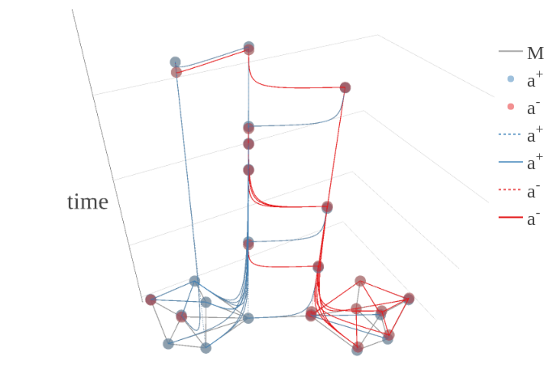

# occmodeller

`occmodeler` is described in:

> Rob Walton and David De Roure. 2019. Modelling web based socio-technical systems through formalising possible sequences of human experience. In Proceedings of 11th ACM Conference on Web Science, Boston, MA, USA, June 30-July 3, 2019 (WebSci ’19), 10 pages.

Interactive versions of the papers figures are [here](https://robwalton.github.io/posts/2019/websci19/), but here is a static image showing two communities fighting out differing opinions on a single issue.

A PDF of the paper will be available soon.

## Dependencies and Installation

For now, see the development section below for clues to installation. More to follow.

## Dependencies

`occmodeller` depends on the closed source [Spike](https://www-dssz.informatik.tu-cottbus.de/DSSZ/Software/Spike) software. This is a risk as Spike ships with no license and so cannot be included here. The version of `occmodeler` here has been written against Spike 1.0.1 which is currently unavailable for download. I am in communication with Spike's developers!

## Building a model

## Simulating a model

## Reducing results and visualising

## Using sacred for simulation management

# Development (plan)

## Restructure

The code is currently being restructured to
* abstract Spike out, current Spike code is specific to crafting .andl files from a repeated unit which is overly limiting however.
* remove the dependency on Sacred for running experiments,
* create a clean API for interactive use.

Following this the code will be refactored as required to add functionality, but expecially fragile bits include:

* creating `.andl` files
* creating `.spc` files
* starting spike for each run adds overhead

## Code structure

The occmodeller repo currently contains three packages

1. `pyspike` will contain only code which is Spike specific. The package is undergoing a refactor in which other code is being distributed between...

2. `occ` contains the interface to occmodeller and everything which is not specifically Spike dependent although this may be difficult without considerable time spent on it.

3. `occdash` is a Plotly dashboard current for viewing the results of simulations captured with Sacred.

These depend on each other from bottom to top. As the code settles I will make these pypi package and fixup dependencies and testing. For now the software includes a PyCharm project which sets up these dependencies.

## Architecture
* https://community.plot.ly/t/live-update-by-pushing-from-server-rather-than-polling-or-hitting-reload/23468 for pushing to an open dash view.
* Use https://github.com/plotly/jupyterlab-dash to open a dash dashboard for each run OR move to ipywidgets.
* https://github.com/nteract/papermill may help with below, or replace the primitive libraries for example with just interactive code. https://medium.com/netflix-techblog/scheduling-notebooks-348e6c14cfd6

* Create a SystemModel variant which includes the python code to create the model and or initial conditions and (perhaps in a form that takes depedency injection like e.g. pytest or Spring) . Include this in the model run. IT should take the form of Jupyter notebook which results in a SystemModel object which can be run. Each time the notebook file is passed to SimRunner the git repo it is in is commited. If we allow that the resulting output files form a subrepo and we commit only after these have run then we would also get the evoloution of the files. Each run...

* Build the GUI out of Jupyter Lab. Create a url or [command](https://jupyterlab.readthedocs.io/en/stable/user/urls.html#managing-workspaces-cli) to open a workspace from every past run. Clicking on this generates a clone as the original run can't be changed. This clone will have the files used to create the model copied from the run to a temprary staging area where they can be changed and either run, left open as a workspace in a queue of experiments to run, or acting as the basis of ones planned to run much later. If run they will be archived permenantly in the system we have now. This results in a lot of duplication. Having the model being something we keep in git and each time perhaps we push it to server this triggers a run resulting in a set of files attached to the original push by a subsequent commit or just by commit-id. In this system a repo holds a branch for each new model we want to develop.

Clone workspace for the last run (or any other past run) to create the basis for the next. Keep a directed graph of runs in this way.

## Packaging

- [ ] Spike license and deployment
- [ ] Add setup and dependencies
- [ ] Testing with tox (although not compatable with anaconda)
- [ ] Consider deploy to : [mybinder.com open source interactive doc server](https://mybinder.readthedocs.io/en/latest/using.html#generating-interactive-open-source-package-documentation) or similal

-
